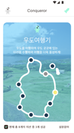
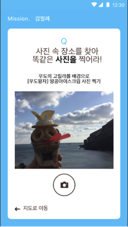
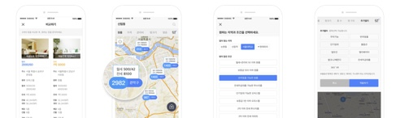
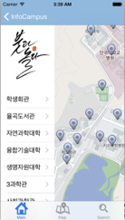
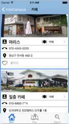

Blog : https://devny.github.io

Github : https://github.com/devny

LinkedIn : https://www.linkedin.com/in/devny/

---

## 경력

###  Zipbrothers

 2016.06.27 ~ 2017.02.19 / iOS 개발 담당

###  Station3

 2017.03.13 ~ 현재 / iOS 개발팀 사원

---
## **회사 프로젝트**

### 정복자

* **소속 : ZipBrothers**
* **역할 : iOS 앱 개발**
* **사용기술 : Alamofire, SwiftyJson, QRCode**
* **상세설명 :** 
서강대 창업 동아리 외주를 받아 개발
우도 관광지에 부착된 QR Code 인식 및 사진 업로드를 통한 게임 앱

* **앱 서비스 종료**

### **다방 1차 리뉴얼**

* **소속 : Station3**
* **역할 : iOS 앱 개발**
* **사용기술 : iOS, Swift, Alamofire, ReSwift, PromiseKit, Gloss 등**
* **상세설명 :**
기존 Ovjective_C로 작성된 앱을 Swift로 Converting한 프로젝트
앱 내 Global한 데이터의 신뢰성을 보장하기 위해 ReSwift를 적용.
네트워크 통신을 함수형으로 구현하기 위해 PromiseKit 적용.
서버 응답으로 json을 효과적으로 파싱하기 위해 Gloss 적용.
****

### **다방 2차 리뉴얼**

* **소속 : Station3**
* **역할 : iOS 앱 개발**
* **사용기술 : 1차 리뉴얼 + RxSwift, Eureka 등**
* **상세설명 :**
앱 내 전체적인 UI 개선과 아파트 매물 추가를 위한 프로젝트
데이터 변화에 따른 반응형 프로그래밍을 위해 RxSwift 적용
UITableView의 Form 구성 편의를 위해 Eureka 적용
****

### **다방 3차 리뉴얼**

* **소속 : Station3**
* **역할 : iOS 앱 개발**
* **사용기술 : 2차 리뉴얼과 동일**
* **상세설명 :**
앱 내 다중 필터 기능 적용과 오피스텔 매물 추가를 위한 프로젝트

****

### **다방 분양 업데이트**

* **소속 : Station3**
* **역할 : iOS 앱 개발**
* **사용기술 : 기존 framework + SkeletonView**
* **상세설명 :**
분양 관련 정보 및 알림을 추가한 프로젝트
행복주택, 분양일정, 분양 알림, 면적 정보 출력 구현
분양 리스트를 지역(시 단위), 건물 유형, 분양 단계, 공급 유형 등으로 필터 기능 구현

* **AppStore([https://itunes.apple.com/kr/app/다방-1-500만의 선택-부동산-필수앱/id814840066?mt=8](https://itunes.apple.com/kr/app/%25EB%258B%25A4%25EB%25B0%25A9-1-500%25EB%25A7%258C%25EC%259D%2598-%25EC%2584%25A0%25ED%2583%259D-%25EB%25B6%2580%25EB%258F%2599%25EC%2582%25B0-%25ED%2595%2584%25EC%2588%2598%25EC%2595%25B1/id814840066?mt=8))**

****

### **방주인**

* **소속 : Station3**
* **역할 : iOS 앱 개발**
* **사용기술 : Alamofire, RxSwift, Stevia, ReSwift, PromiseKit, Gloss 등**
* **상세설명 :**
부동산 매물 등록부터 광고까지 다방 파트너 중개사와 연결하여 손쉽게 관리할 수 있는 앱
공실현황(광고 준비, 확인 매물, 일반 매물) 파악 및 확인 매물 승인 기능 구현
나이스 본인 인증을 사용한 인증 구현.
* **AppStore([https://itunes.apple.com/kr/app/방주인-스마트한-공실-관리/id1438069281](https://itunes.apple.com/kr/app/방주인-스마트한-공실-관리/id1438069281))**

****

## **개인 프로젝트**

### **InfoCampus**

대학교 내 시설 위치 및 영업 시간, 주변 맛집 등 정보 안내 앱 

* **사용 기술 : Objective\_C, Daum\_Map, SQLite**
* **상세 설명 :**
캠퍼스 내 시설 전화번호, 위치, 영업 시간등 학생에게 필요한 정보를 안내**
캠퍼스에서 가까운 맛집, 세탁소, 편의점 등의 전화번호, 위치, 영업 시간 등을안내
학생들이 자주 타는 버스의 도착시간, 현재 위치 등의 정보를 안내
* **앱 서비스 종료**

****

### **Dust** 

현재 위치를 기반으로 미세먼지 정보를 직관적으로 보여주는 위젯 앱

* **사용 기술 : Swift, RxSwift, Moya, Firebase, AdMob, Fabric, Crashlytics**
* **상세 설명 :**
Air Korea의 공공 데이터를 이용하여 현재 위치를 서버에 전송해 현재 위치와 가장 가까운 
		미세먼지 측정소의 값을 응답으로 받아 WHO 기준을 적용해 8가지 단계로 구분하여 
		사용자에게 직관적인 UI를 제공.

* **AppStore([https://itunes.apple.com/kr/app/dust/id1434796687?mt=8])**